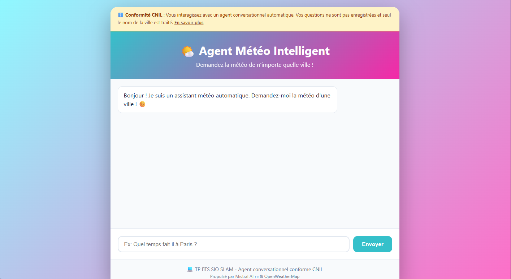

**README - Agent Météo (Technique)**

**Description**: Ce projet fournit un agent conversationnel météo simple (Flask) qui combine Mistral AI pour l'extraction d'entités et la génération de texte, et OpenWeatherMap pour les données météo. Il est conçu pour minimiser la collecte de données et respecter les recommandations CNIL : pas de stockage des conversations et collecte réduite (ville uniquement).

**Structure du projet**
- **`app.py`**: Point d'entrée Flask. Définit les routes `/`, `/chat` (POST) et `/stats` (GET) et vérifie la présence des clés API au démarrage.
- **`agent_meteo.py`**: Logique principale de l'agent : intégration Mistral, extraction de la ville, appel à OpenWeatherMap, génération de la réponse.
- **`requirements.txt`**: Liste des dépendances Python requises.
- **`.env`**: Fichier de configuration local contenant les clés API (ne pas committer).
- **`templates/index.html`**: Interface frontale minimale (page d'accueil).
- **`static/style.css`**: Styles associés à la page.

**Dépendances**
- Les versions présentes dans `requirements.txt` (à la racine) :
  - `mistralai==1.0.0`
  - `requests==2.31.0`
  - `python-dotenv==1.0.0`
  - `flask==3.0.0`
  - `werkzeug==3.0.1`

**Configuration (variables d'environnement)**
- Créez un fichier `.env` à la racine (ou copiez/renommez `.env.example` si présent).
- Valeurs attendues :
  - `MISTRAL_API_KEY` : clé API Mistral AI
  - `OPENWEATHER_API_KEY` : clé API OpenWeatherMap

Ne commitez jamais vos clés API. Ajoutez `.env` à `.gitignore` si ce n'est pas déjà fait.

**Installation locale**
1. Créez et activez un environnement virtuel :

```bash
python3 -m venv .venv
source .venv/bin/activate
```

2. Installez les dépendances :

```bash
pip install -r requirements.txt
```

3. Créez un fichier `.env` et renseignez vos clés :

```text
MISTRAL_API_KEY=votre_cle_mistral
OPENWEATHER_API_KEY=votre_cle_openweather
```

**Lancer l'application**
- En local (mode debug) :

```bash
python app.py
```

- L'application écoute par défaut sur `http://localhost:5000`.

**API / Endpoints**
- `GET /` : page d'accueil (rend `templates/index.html`).
- `POST /chat` : endpoint principal du chatbot.
  - Requête attendue : JSON `{ "message": "Quel temps à Paris ?" }`.
  - Réponse : JSON contenant au minimum `success` (bool) et `message` (texte). En cas de succès, la clé `data` contient les données météo extraites.
  - Exemple (curl) :

```bash
curl -X POST http://localhost:5000/chat \
  -H 'Content-Type: application/json' \
  -d '{"message":"Quel temps fait-il à Paris ?"}'
```

- `GET /stats` : renvoie des statistiques anonymes (ex. `total_requetes`). Aucune donnée personnelle n'est stockée.

Format de réponse attendu (exemple) :

```json
{
  "success": true,
  "message": "À Paris, il fait 12°C...",
  "data": {
    "ville": "Paris",
    "temperature": 12.0,
    "ressenti": 11.0,
    "description": "légère pluie",
    "humidite": 87,
    "vent": 14.4
  }
}
```

**Détails techniques / Comportement interne**
- `AgentMeteo` (dans `agent_meteo.py`) :
  - Utilise la librairie `mistralai` pour interroger le modèle `mistral-small-latest`.
  - `extraire_ville(message)` : envoie un prompt système (conforme CNIL) pour extraire le nom de la ville ou demander la ville si elle n'est pas fournie.
  - `obtenir_meteo(ville)` : appelle l'API OpenWeatherMap (`/data/2.5/weather`) avec `units=metric` et `lang=fr` et retourne un sous-ensemble des données (température, ressenti, description, humidité, vent).
  - `generer_reponse(meteo_data)` : utilise Mistral pour formuler une réponse naturelle et concise à partir des données météo.

**Politique de confidentialité & conformité**
- Aucune conversation n'est persistée sur le serveur.
- Collecte limitée : seul le nom de la ville est nécessaire pour la requête météo.
- Statistiques anonymes (`total_requetes`) uniquement : pas d'identifiants utilisateur.

**Gestion des erreurs et points d'attention**
- Au démarrage, `app.py` vérifie que `MISTRAL_API_KEY` et `OPENWEATHER_API_KEY` sont définies ; sinon, le script s'arrête avec un message d'erreur.
- Si OpenWeather renvoie 404 pour une ville, l'agent retourne un message utilisateur indiquant que la ville est introuvable.
- Les appels Mistral peuvent échouer : des fallback basiques existent (message d'erreur convivial).

**Dépannage rapide**
- Message "Clés API manquantes" : vérifiez `.env` et que les variables sont exportées.
- Erreur 404 sur OpenWeather : vérifiez l'orthographe de la ville ou testez via l'API OpenWeather directement.
- Problèmes Mistral : vérifiez la validité de `MISTRAL_API_KEY` et la latence réseau.

**Suggestions / Evolutions possibles**
- Ajout d'un cache court (ex. TTL 5 min) pour limiter les appels OpenWeather.
- Ajout de tests unitaires pour `AgentMeteo.extraire_ville` et `obtenir_meteo` (mocks pour APIs externes).
- Emballage en conteneur Docker pour déploiement reproductible.

**Contribuer**
- Fork, branch, PR : ajoutez tests pour toute modification importante.
- N'incluez jamais vos clés API dans les commits.

**Aperçu application**



— Fin —
